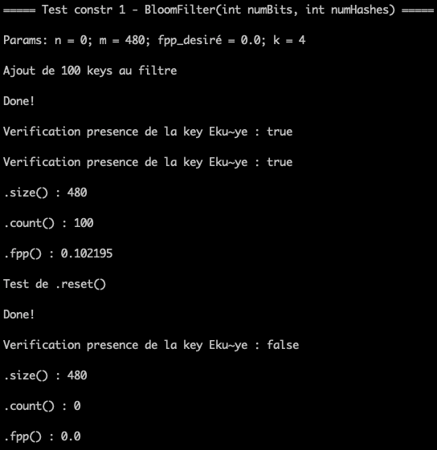
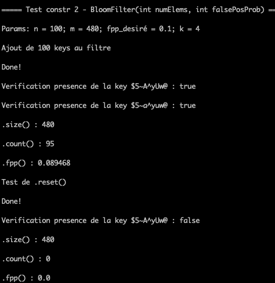

# Filtres de Bloom - Implémentation en Java

## Généralités

De manière succincte, un filtre de Bloom, conçu par Burton Howard Bloom en 1970 dans le papier http://www.cs.upc.edu/~diaz/p422-bloom.pdf est une structure de données de type probabiliste très efficace en terme de gestion d’espace dont le but principe est de fournir le possibilité de d'affirmer avec certitude qu’un élément ou une clé n'est pas présent dans un ensemble, et avec une certaine probabilité que la clé en question est present dans l'ensemble. Ceci signifie qu'il est possible d’avoir de faux positifs, mais jamais de faux négatifs. Le filtre offre la possibilité de controller la probabilité de faux positifs dépendamment des besoins de l’implantation.

Une application d’un filtre serait par exemple de disposer d’une liste de certains éléments et que l’on veut avec certitude et avec une complexité O(1) vérifier si un élément donné est absent sans avoir besoin de parcourir tous les élément de la liste.

Un filtre de bloom nécessite d’implanter un ensemble de bits (BitSet) et une fonction de hachage. Le choix de la fonction de hachage est très important pour la performance du filtre et doit être choisi de manière a être rapide et en même temps permettre d’éviter le plus possible les collisions.

## Les maths

Soient un filtre de Bloom dont les paramètres sont les suivants:

nBits = entier representant le nombre de bits du filtre ou la taille de l'ensemble de bits

nHash = entier representant le nombre de fonction de hachage desiré ou necessaire

nElem = entier representant le nombre de d'éléments que le filtre est supposé contenir

fpPro = decimal représentant la probabilité de faux-positive desirée.

Les relatinons sont les suivantes:

nHash = (int)ceil(-log(fpPro)/log(2))

nBits = (int)ceil(-nElem*log(fpPro)/(log(2))**2)

## Descriptions des classes écrites

1. BitSet.java
La classe qui implante l’ensemble de bits utilise par le filtre.

2. HashFunction.java
La classe qui implante la fonction de hachage. Elle s'occupe de la génération de nombre **nHash** de fonction de hashage necessaire.
La classe utilise le principe de Hashage universelle ([https://en.wikipedia.org/wiki/List_of_prime_numbers]) et celui du double hachage pour la Gestion de collision ([https://en.wikipedia.org/wiki/Double_hashing]).

3. BloomFilter.java
Cette classe crée le filtre de Bloom. On y implémente deux constructeurs différents.
Le premier constructeur crée un filtre basé sur la taille de l'ensemble de bits **nBits** et le nombre de fonctions de hachage **nHash**.
Le deuxième constructeur crée un filtre basé sur le nombre d'éléments attendus dans le filte nElem et de la probabilité de faux positifs désirée **fpPro**.

4. TestsBloomFilter.java
Cette classe contient les tests unitaires du filte.
On y procède à la génération automatique de n keys de tailles entre MinSize et MaxSize.
Les keys sont ensuite ajoutés au filtre pour tester chacune des fonctions.

## Resultats de tests

